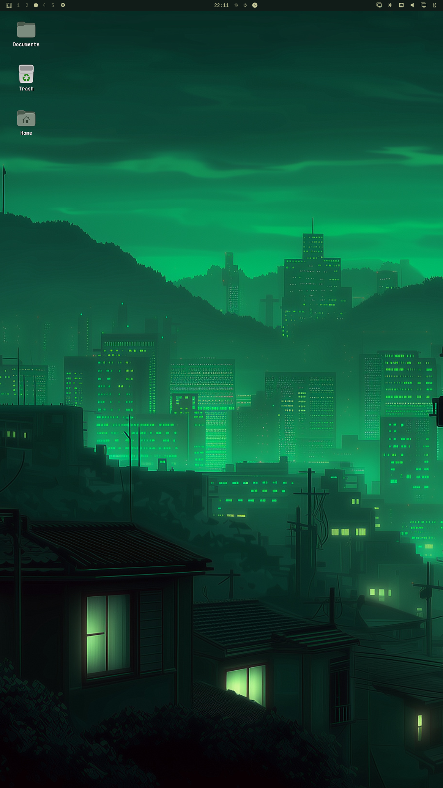

# Desktop Icons

Windows-style files and shortcuts on the Omarchy wallpaper.



> [!IMPORTANT]
> This plugin is for **Omarchy 4 (Quattro)**, where the desktop shell uses
> [Quickshell](https://quickshell.org/).

## What it does

- Shows `~/Desktop` as icons on every monitor, under windows and the bar
- Click an icon to open it; drag to move it (snaps to a grid)
- Right-click empty wallpaper: New Folder, New Shortcut, Pin application, Add files
- Right-click an icon: Open, Show in Files, Move to Trash
- Drag an icon onto Trash, or drop files from Files onto Trash, to delete them
- Drag files from Files onto the wallpaper to copy them there
- Click empty wallpaper five times to switch the background (`Super+Ctrl+Space` still works)
- Untrusted `.desktop` launchers show a warning badge and ask before they run

`.desktop` launchers only run if they are trusted: they came from Applications, the file is marked executable, or you allow launching from the desktop (same model as GNOME). Names and icons from launchers are treated as plain text and local theme or raster image files only. Remote URLs, inline resources, SVG/GIF icon loading, and unbounded Desktop folders are rejected.

## Install

Point Omarchy at a real `~/Desktop` folder first, if you do not already have one:

```bash
mkdir -p ~/Desktop
```

In `~/.config/user-dirs.dirs` set:

```bash
XDG_DESKTOP_DIR="$HOME/Desktop"
```

Then:

```bash
xdg-user-dirs-update
```

Review the repository, then add the plugin:

```bash
omarchy plugin add https://github.com/Henri1130/omarchy-desktop-icons.git
```

Accept the prompt to enable the plugin during installation.

For an unattended install from a repository you already trust:

```bash
omarchy plugin add https://github.com/Henri1130/omarchy-desktop-icons.git --enable --yes
```

Restart the shell once after enabling, so the icon layer gets a full click mask:

```bash
omarchy restart shell
```

### Files context menu (optional)

To add **Send to Desktop (create shortcut)** and **Copy to Desktop** in Files:

```bash
mkdir -p ~/.local/share/nautilus-python/extensions
cp ~/.config/omarchy/plugins/henri.desktop-icons/nautilus/add_to_desktop.py \
  ~/.local/share/nautilus-python/extensions/
nautilus -q
```

Optional: float the pin/add dialogs in `~/.config/hypr/hyprland.lua`:

```lua
o.window("org.omarchy.add-to-desktop", { float = true, center = true })
```

## Use

| Action | How |
| --- | --- |
| Open | Click an icon (untrusted launchers ask first) |
| Select / keyboard | Click the wallpaper, then `Tab` / arrows to move; `Enter` opens, `Delete` trashes, `Esc` cancels |
| Allow a launcher | Click **Trust and Open**, or right-click **Allow launching** |
| Move an icon | Drag it; it snaps to the grid |
| Put a file on the desktop | Drag it onto the wallpaper, or copy it into `~/Desktop` |
| Pin a shortcut | Right-click wallpaper → Pin application… / New Shortcut… |
| Trash | Right-click an icon → Move to Trash, press Delete, or drag onto Trash |
| Change wallpaper | Click empty wallpaper five times, or `Super+Ctrl+Space` |

Pinned applications, New Shortcut, and **Send to Desktop** mark launchers as trusted. A `.desktop` file that merely appears in `~/Desktop` without the executable bit does not.

## Update

```bash
omarchy plugin update henri.desktop-icons
```

## Disable

```bash
omarchy plugin disable henri.desktop-icons
```

## Uninstall

```bash
omarchy plugin remove henri.desktop-icons
```

## Validate from source

```bash
omarchy plugin validate .
```

## Improvements

These changes keep the plugin's security model intact (remote/SVG icons
rejected, trust required, sizes bounded, no shell-out of Exec) while
improving responsiveness, ordering, and accessibility:

- **Instant refresh:** the Desktop folder is watched via a `FileView`
  (`watchChanges`), so icons appear, move, or get deleted instantly when the
  watch fires. A 1.5 s poll backs it up, so add/delete always applies within
  ~1.5 s even if the watch misses an event.
- **Keyboard navigation:** `Tab` / `Shift+Tab` / arrow keys move the
  selection in visual grid order (top-to-bottom, left-to-right); `Enter`
  opens, `Delete` trashes, `Esc` cancels.
- **New items at the bottom, no overlap:** added shortcuts or folders are
  placed in the bottom-most free grid cell (just past the last icon),
  skipping any cell already occupied by a manually dragged icon. Existing
  icons keep their positions, and dragging an icon is never disturbed.
- **Trust prompt by the icon:** the "Untrusted launcher" dialog now opens
  next to the icon instead of screen-centered.
- **Cleaner code:** `desktop_dir()`, `guess_icon()`, and `unique_dest()`
  were extracted into `bin/common.py` and imported by both `desktop-index`
  and `add-to-desktop`.
- **Correct paths:** `place_one` returns the real created path (capturing
  the helper's stdout), and `add-to-desktop` prints the created path.
